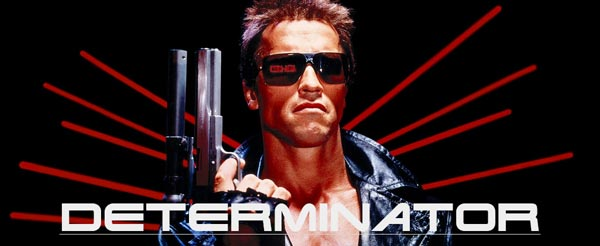

# Determinator

A gem that works with [Florence](https://github.com/deliveroo/actor-tracking) to deterministically calculate whether an actor (a customer, rider, restaurant or employee) should have a feature flag turned on or off, or which variant they should see in an experiment.



## Installation

Add this line to your application's Gemfile:

```ruby
gem 'determinator'
```

And then execute:

    $ bundle

Or install it yourself as:

    $ gem install determinator

## Usage

Check the example Rails app in `examples` for more information on how to make use of this gem.

## Contributing

Bug reports and pull requests are welcome on GitHub at https://github.com/deliveroo/determinator. This project is intended to be a safe, welcoming space for collaboration, and contributors are expected to adhere to the [Contributor Covenant](http://contributor-covenant.org) code of conduct.

## License

The gem is available as open source under the terms of the [MIT License](http://opensource.org/licenses/MIT).

